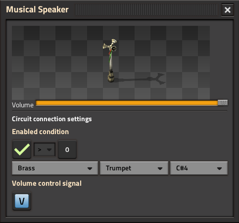

# Forked because of a typo

Original repo by [Xcelled](https://github.com/Xcelled/musical-speaker), latest release there however does not work.

# musical-speaker

A Factorio mod that provides an enhanced version of the programmable speaker, mostly intended for music production.

Sound data for this mod was generated by [FluidSynth](http://www.fluidsynth.org/) (GPL licensed) from the [FluidR3_GM2 soundfont](https://member.keymusician.com/Member/FluidR3_GM/index.html) (MIT licensed). Much thanks goes to the developers of these projects.

Features:
- Includes 189 instruments.
	- Provides all instruments specified by [General Midi Level II](https://en.wikipedia.org/wiki/General_MIDI_Level_2).
- _All_ melodic (non-percussion) instruments have a range of A0 to C8, AKA standard 88-key piano.
- All percussion instruments provide GM2 drum sounds.
- Sounds stop when the speaker is disabled via circuit network (Vanilla programmable speaker continues playing).
- Control volume via circuit network.




# Installation

Right now, the number of sound files in the mod precludes uploading it directly to the mod portal. To install the mod, download the release zip file from [GitHub](https://github.com/Xcelled/musical-speaker/releases) and drop it into your mods directory.

# Example usage
This [video](https://www.youtube.com/watch?v=WMUe16I7cuk) was made entirely in Factorio by utilizing musical-speaker. You can grab the save from [here](https://github.com/Xcelled/musical-speaker/raw/saves/piano-let%20it%20go.zip) to try it yourself!

[](https://www.youtube.com/watch?v=WMUe16I7cuk "Let it go - Factorio Style")

# Caveats
- For right now, enabled condition comparison is limited to `> 0`.
	- If you want a different condition, use a decider combinator to translate the condition.
- Volume can be set by the circuit network only during the tick when a note starts playing.
	- This is for performance reasons, due to the expensive nature of querying the circuit network.
	- I might make this an option in the future.
- For performance reasons, musical speaker sounds are _not_ pre-loaded by the game.
	- This means that there will be a slight-but-noticeable delay the first time each note is played.
	- If you're in a situation where you need minimal delay (ie recording), play your composition once ahead of time to warm up the sounds.

# Helpful Tips
- To convert a midi note number to a melodic pitch, subtract 21.
- To convert a midi note number to a percussion sound, subtract 35

# Future Plans
- Circuit-network signal to control instrument.
- Make enabled condition fully controllable.
- Support GM2_SM (?).
- Split the sounds from the code
	- This is required to be able to upload the mod to the portal

# Implementation
- Musical-speaker is implemented in _TypeScript_ and transpiled to lua by the amazing [TypeScriptToLua](https://typescripttolua.github.io/). I doubt musical-speaker would have been finished without this project.

# Developing

**tl;dr for those who have done nodejs work before:** Musical-speaker is like any other nodejs/yarn project.

## Setup
To work with Musical-speaker locally, you need the following:
- [nvm](https://github.com/nvm-sh/nvm#installing-and-updating) (Windows users see [here](https://dev.to/skaytech/how-to-install-node-version-manager-nvm-for-windows-10-4nbi))
- [yarn](https://riptutorial.com/node-js/example/29249/yarn-installation)

Once these are installed, run the following to setup your local environment:
```sh
nvm install
nvm use
yarn
yarn copy-sounds
```

### Setup Symlink

To ease development, you may wish to symlink the `dist` folder into your [Factorio mod directory](https://wiki.factorio.com/Application_directory). This will allow Factorio to read musical-speaker directly from your latest compiled code.

Examples:

#### Linux
```sh
cd dist
ln -s "$(pwd)" ~/.factorio/mods/musical-speaker
```

#### MacOSX
```sh
cd dist
ln -s "$(pwd)" ~/Library/Application Support/factorio/mods/musical-speaker
```

#### Windows
```bat
cd dist
mklink /D "%appdata%\Factorio\mods\musical-speaker" %cd%
```
## Developing
General flow:
- Edit the typescript in `src/`
- Run `yarn build` to transpile to Lua. Transpiled code lives in `dist/`
- Try out your changes in Factorio

To get instant feedback from TypeScript each time you hit save during development, run this command:

```sh
yarn dev
```

### Sound files

Because the sound files are so numerous, they are not automatically copied to the `dist` folder. If you want to update the sound files, you must run `yarn copy-sounds`.

### Debugging

While TypeScript eliminates a large class of common errors, things can still go wrong and lead to a crash.

If you get an error or a stack trace, you'll probably have to compare it to the generated lua in `dist`. TypeScriptToLua does have support for sourcemaps back to the TypeScript code, but they're not respected by Factorio when it generates stack traces.

You can use extensions like [Factorio Mod Debug](https://marketplace.visualstudio.com/items?itemName=justarandomgeek.factoriomod-debug) to step though and inspect the generated lua code.
